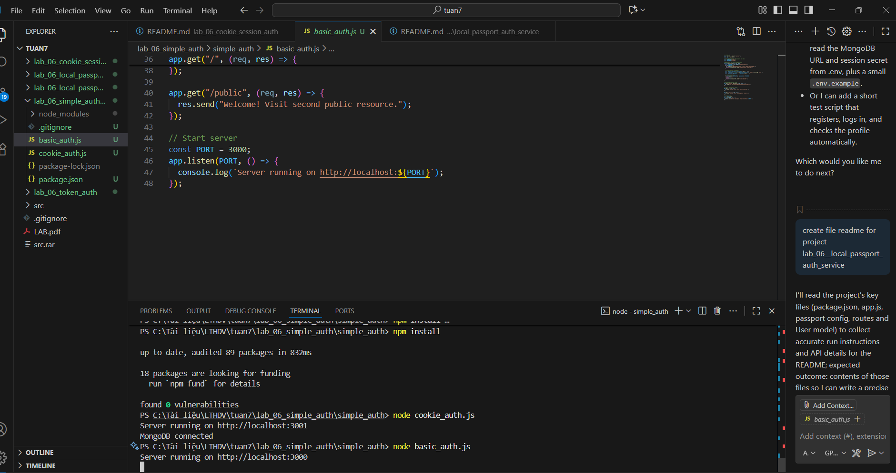
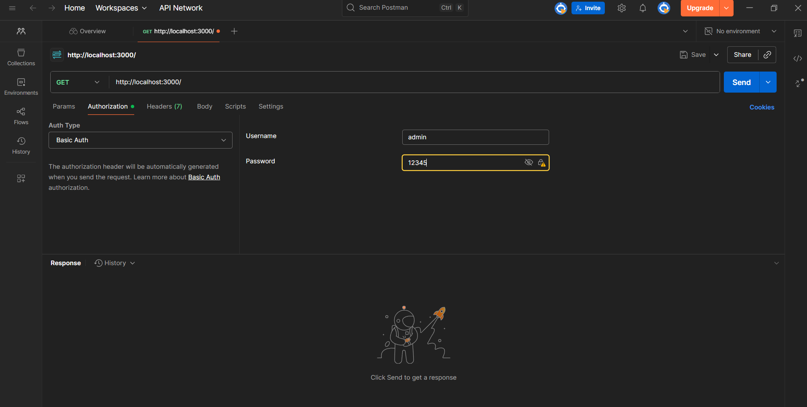
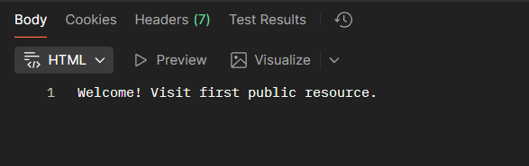
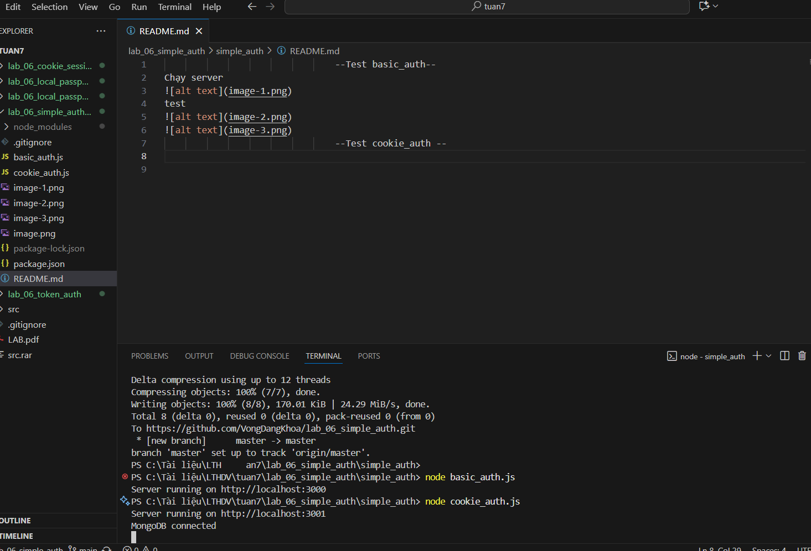
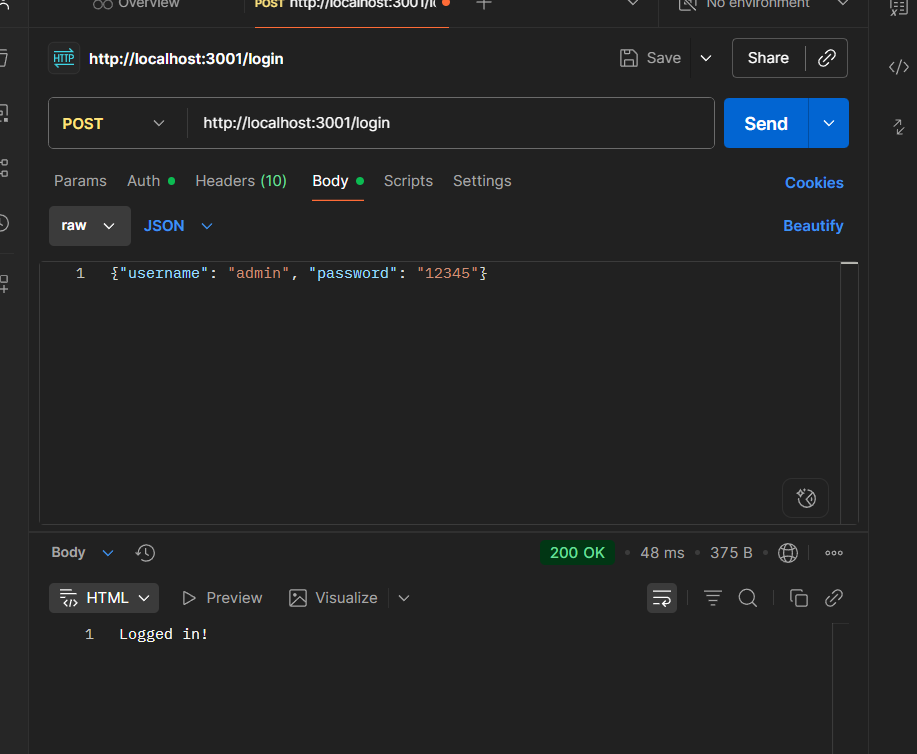
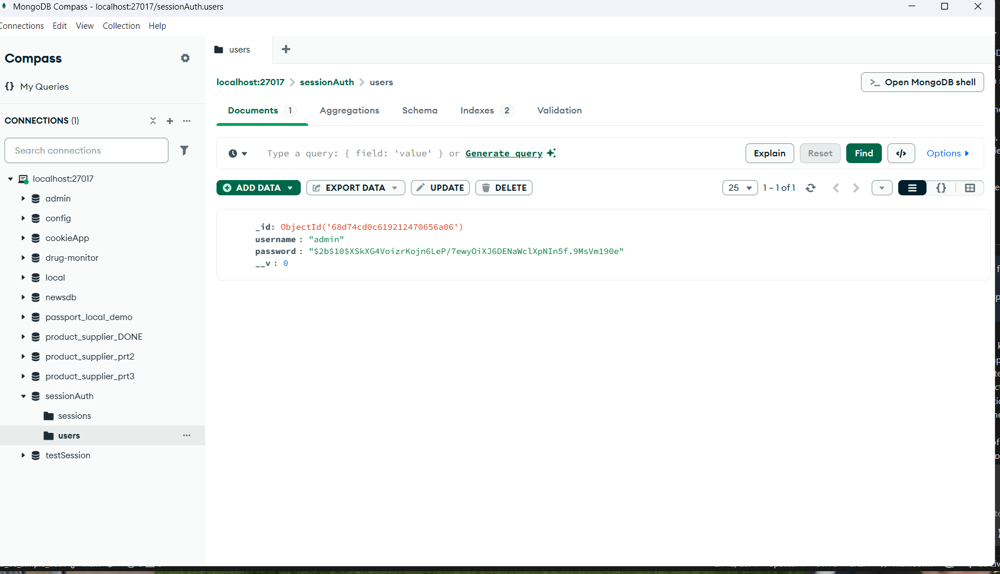

                                                Test basic_auth
chạy server                                                

test

show

                                                Test cookie_auth
chạy server

test + show

